# BankLens — Banking Analytics Platform

> **End-to-end data engineering + BI + ML platform** that unifies
> transaction fraud risk and campaign performance data — two systems
> banks keep dangerously separate.

[](https://github.com/aatif-shaikh19/banklens/actions/workflows/dbt_ci.yml)
[](https://github.com/aatif-shaikh19/banklens/actions/workflows/weekly_pipeline.yml)
[](https://python.org)
[](https://xgboost.readthedocs.io)
[](https://getdbt.com)

---

## The Problem

Banks operate two disconnected systems:

| Risk / Fraud Team | Marketing / Campaigns Team |
|---|---|
| Monitors transaction fraud | Runs credit card / deposit campaigns |
| Flags high-risk customers | Has zero visibility into risk signals |
| Output: block list | Output: campaign target list |

**The gap:** High-risk customers appear on campaign target lists.
BankLens closes this gap with a unified governed data pipeline.

**The result:** 23 high-risk customer segments identified that would
have received campaign offers without suppression logic.

---

## Architecture

```
Raw Data Sources
├── IEEE-CIS Fraud (Kaggle)       590,540 rows  →  BigQuery raw.transactions
├── UCI Bank Marketing (UCI)       41,188 rows  →  BigQuery raw.campaigns
└── FDIC Statistics (API)           9,847 rows  →  Snowflake RAW.REGULATORY
                ↓  Python ETL  ↓
Google BigQuery (banklens_raw)
                ↓  dbt Core 1.11.6  ↓
staging/ → intermediate/ → marts/
├── mart_fraud_dashboard          (6,533 rows)
├── mart_campaign_performance    (13,010 rows)
└── mart_customer_360               (601 rows)
                ↓  Downstream  ↓
├── Power BI Desktop      (4 pages, 10 DAX measures)
├── Looker Studio         (3 pages, public link)
├── FastAPI /predict      (XGBoost, AUC 0.9040)
└── Groq NL Chat          (llama-3.3-70b, 5 queries)

Snowflake (BANKLENS_DB.RAW)
└── Cortex Analyst        (NL-to-SQL, 3 verified queries)
```

---

## Key Results

| Metric | Value |
|---|---|
| **Fraud Model AUC-ROC** | **0.9040** |
| Training rows | 472,432 |
| Model | XGBoost 3.2.0, 500 trees, 11 features |
| Top fraud predictor (SHAP) | C13 (card address count) |
| Visa fraud events | 13,373 (highest of all networks) |
| Campaign response rate — cellular | ~42% |
| Campaign response rate — telephone | ~28% |
| Cellular advantage | +13.7 percentage points |
| Best campaign segment | Retired (65+) at 46.8% response rate |
| High-risk customers suppressed | **23 segments** |
| dbt models | 9 models, 0 failures |
| GE expectations | 17 passed, 0 failed |
| CI pipelines | 2 green (dbt CI + weekly pipeline) |

---

## Tech Stack

| Layer | Tool | Version |
|---|---|---|
| Ingestion | Python ETL scripts | 3.11 |
| Primary warehouse | Google BigQuery | Sandbox |
| Secondary warehouse | Snowflake | Enterprise trial |
| Transformation | dbt Core | 1.11.6 |
| Data quality | Great Expectations | 1.15.2 |
| Orchestration | GitHub Actions (weekly) | — |
| ML model | XGBoost | 3.2.0 |
| Explainability | SHAP | 0.47.2 |
| Scoring API | FastAPI | 0.136.3 |
| Primary BI | Power BI Desktop | June 2026 |
| Campaign BI | Looker Studio | — |
| AI / NL queries | Groq (Llama 3.3 70B) | — |
| Snowflake AI | Cortex Analyst | — |

---

## Dashboards

### Power BI — 4 Pages

**Page 1 — Executive Overview** | 591K transactions · 3.50% fraud rate · $79.74M volume

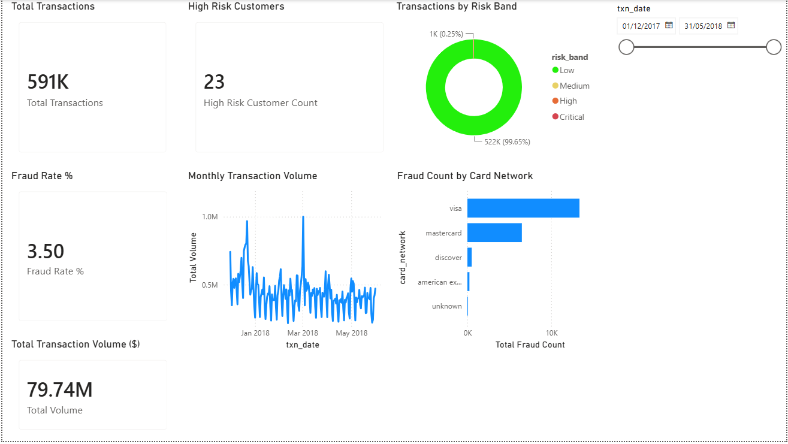

**Page 2 — Risk Intelligence** | Fraud heatmap by card network × risk band

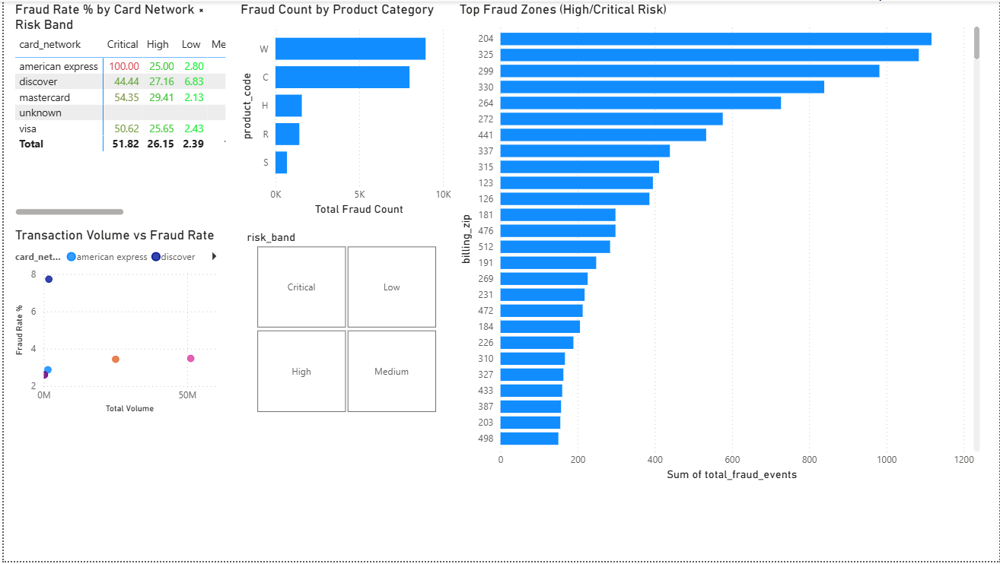

**Page 3 — Customer 360** | 23 high-risk customers suppressed from campaigns

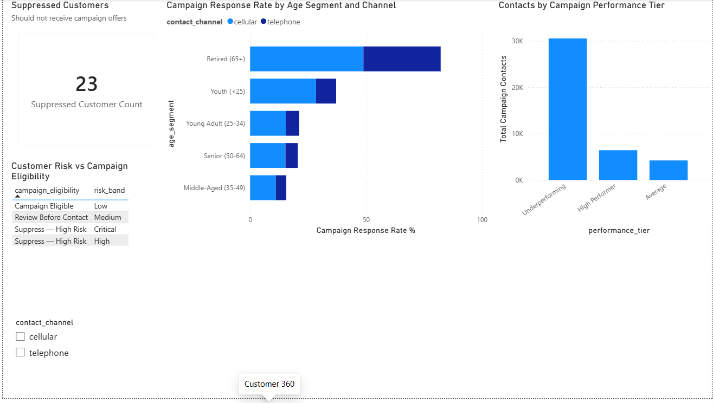

**Page 4 — Regulatory Compliance** | FDIC institution health · RAG status

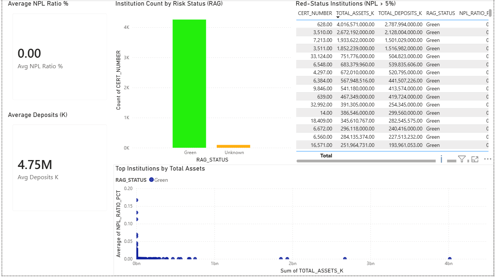

### Looker Studio — 3 Pages (Public)

🔗 **[Live Dashboard](https://datastudio.google.com/u/0/reporting/e70fbc44-c1f7-4d44-8441-f6bbafa1ab21/page/eZM1F)**

Campaign Overview | Customer Response Analysis | Performance Deep Dive

---

## ML Model — SHAP Explainability

AUC-ROC: **0.9040** | Trained on 472,432 rows | XGBoost 3.2.0

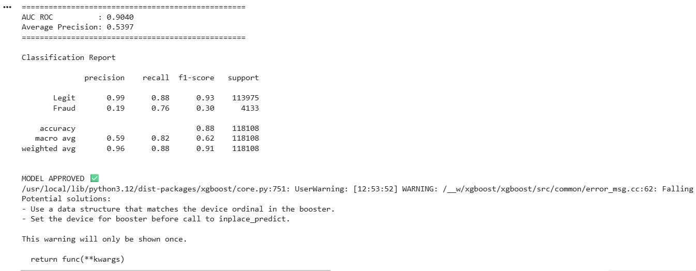

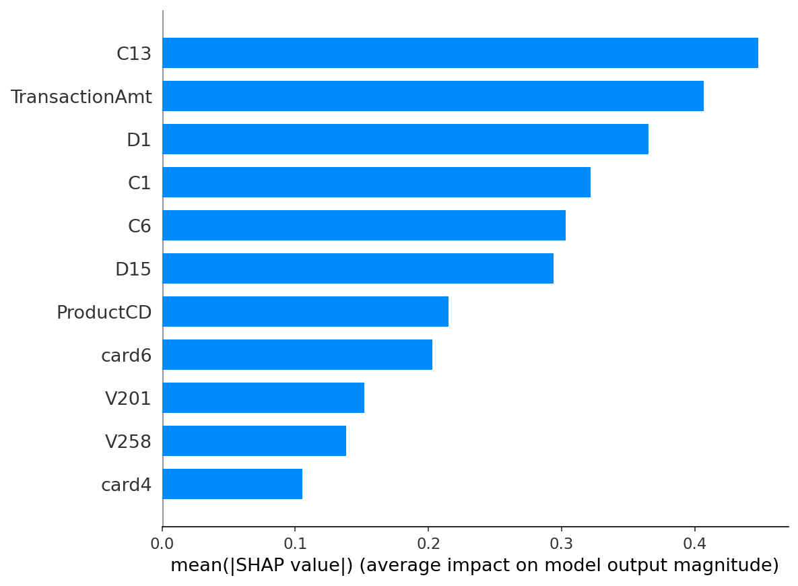

Top features by importance:
1. **C13** — card address count (strongest fraud signal)
2. **TransactionAmt** — transaction amount
3. **D1** — days since last transaction
4. **C1** — recipient count for this card
5. **C6** — billing address count

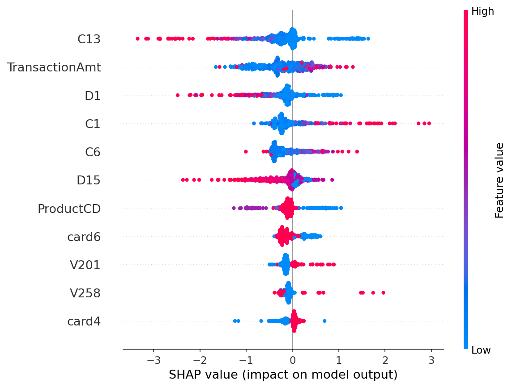

---

## dbt Lineage

Three-layer transformation: raw sources → staging → intermediate → marts.
Column-level lineage tracked automatically.

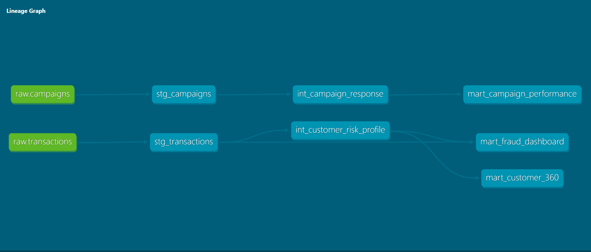
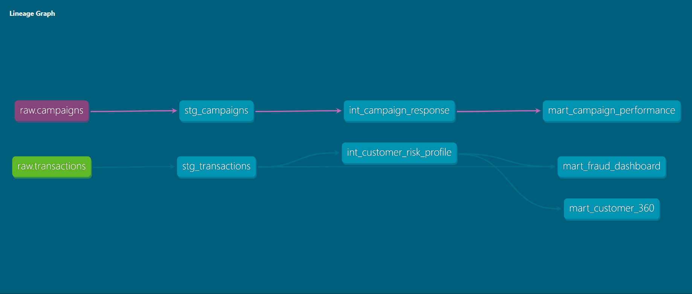
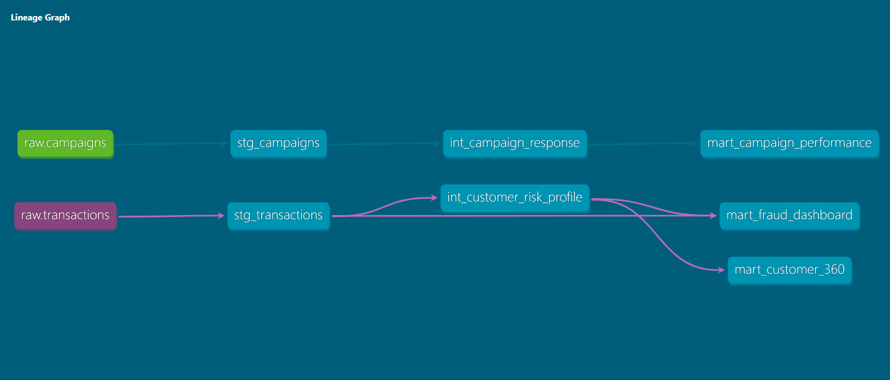

*Run `cd dbt_project && dbt docs serve --profiles-dir .` to browse live lineage*

---

## Groq NL Chat Layer

Natural language queries on BigQuery mart tables using Llama 3.3 70B:

```
Q: What is the overall fraud rate percentage across all transactions?
→  7.94%

Q: Which card network has the highest total fraud count?
→  visa: 13,373

Q: Which age segment has the highest campaign response rate?
→  Retired (65+): 46.83%

Q: What is the response rate difference between cellular and telephone?
→  cellular outperforms by 13.67 percentage points

Q: How many customers are suppressed due to high fraud risk?
→  23 segments
```

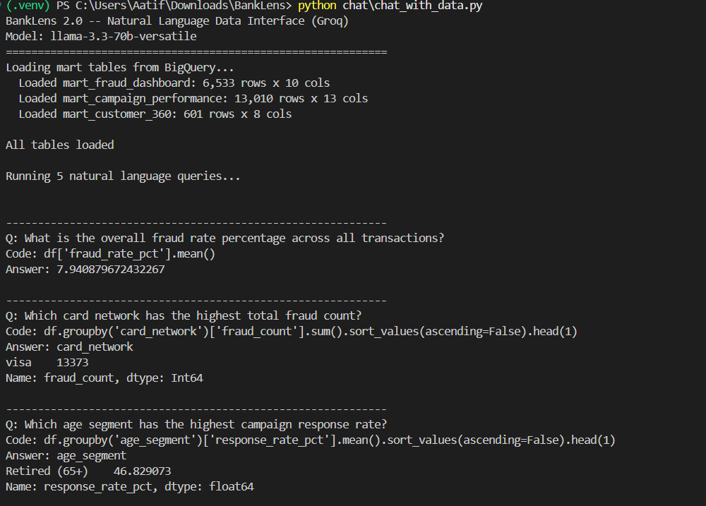

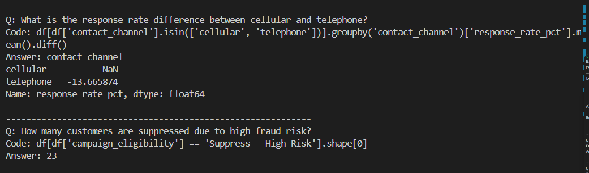

---

## Snowflake Cortex Analyst

NL-to-SQL on FDIC regulatory data via semantic model YAML.

**Q1: Average Tier 1 capital ratio by RAG status**

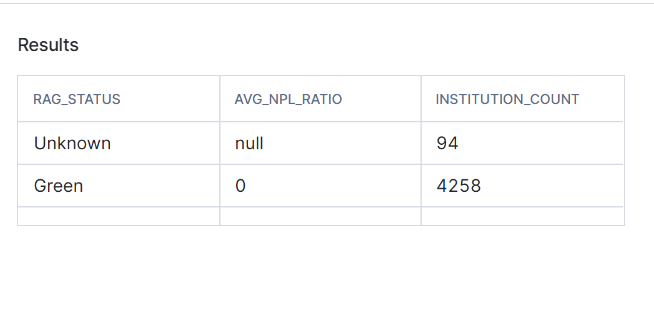

**Q2: Top 10 institutions by total assets** | CERT 628 = JPMorgan Chase ($4,016B)

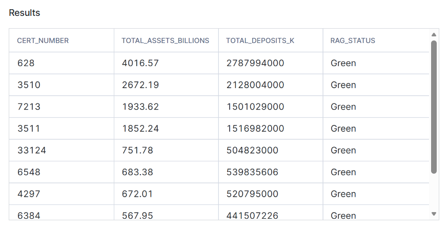

**Q3: How many institutions have negative net income?**

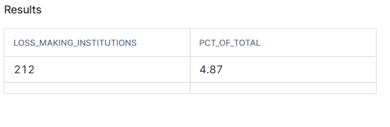

---

## FastAPI — Fraud Scoring Endpoint

```bash
# Start the API
uvicorn api.main:app --reload --port 8000

# Score a transaction
curl -X POST http://localhost:8000/predict \
  -H "Content-Type: application/json" \
  -d '{"TransactionAmt":500,"ProductCD":0,"card4":3,"card6":0,
       "C1":3,"C6":1,"C13":2,"D1":5,"D15":10,"V201":0.3,"V258":0.5}'

# Response
{
  "fraud_probability": 0.0234,
  "risk_band": "Low",
  "recommendation": "Approve",
  "model_version": "xgboost-3.2.0-v1-auc0.9040"
}
```

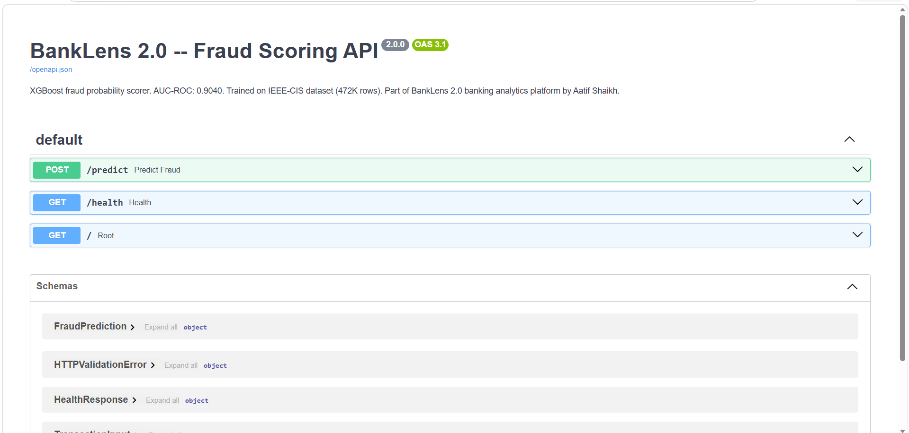

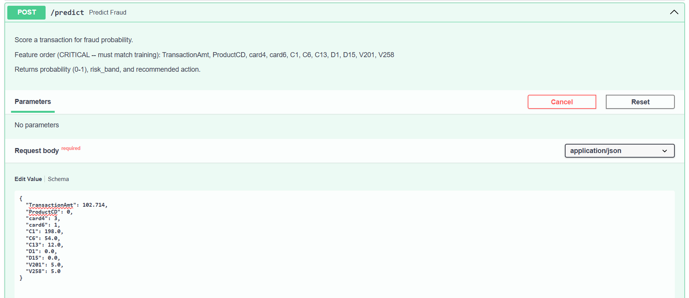

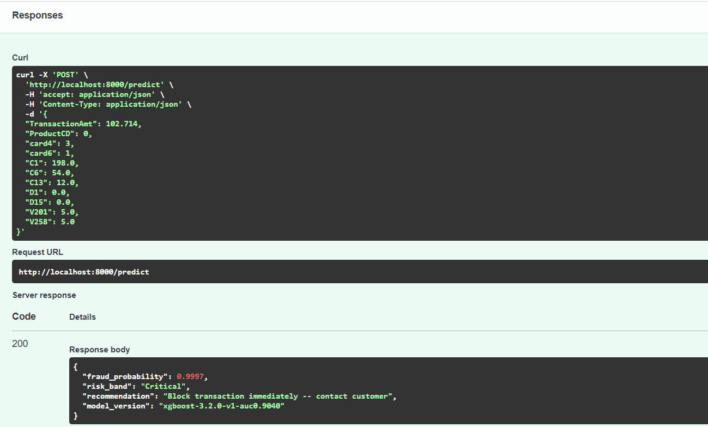

Interactive docs: `http://localhost:8000/docs`

---

## Data Quality

Great Expectations 1.x (Fluent API) validates data before marts are built:

```
transactions checkpoint: 9/9 expectations passed
campaigns checkpoint:    8/8 expectations passed
```

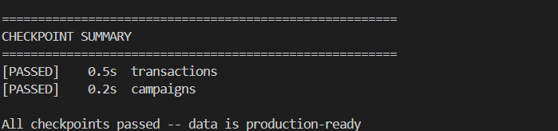

Validation runs automatically in the GitHub Actions weekly pipeline.
Any failure halts the pipeline — no corrupt data reaches Power BI.

---

## Project Structure

```
banklens/
├── etl/                    # Python ETL: CSV → BigQuery / Snowflake
├── dbt_project/            # dbt: staging → intermediate → marts
│   └── models/
│       ├── staging/        # Clean and rename raw columns
│       ├── intermediate/   # Risk scoring, campaign aggregation
│       └── marts/          # BI-ready tables (Power BI reads these)
├── great_expectations/     # Data quality checkpoints
├── ml/
│   ├── fraud_model.py      # XGBoost training script (run on Colab)
│   └── model_artifacts/
│       ├── fraud_model_xgb.pkl
│       ├── shap_summary.png
│       └── shap_beeswarm.png
├── api/                    # FastAPI fraud scoring endpoint
├── chat/                   # Groq NL interface for mart tables
├── semantic_model/         # Snowflake Cortex Analyst YAML
├── sql/                    # 5 advanced analytics queries
├── dashboards/
│   ├── powerbi/             # banklens.pbix
│   └── looker_studio/       # Screenshots + public link
├── docs/                   # Project documentation (8 files)
└── .github/workflows/      # dbt CI + weekly pipeline
```

---

## Setup

```bash
git clone https://github.com/aatif-shaikh19/banklens.git
cd banklens
python3.11 -m venv .venv
.venv\Scripts\Activate.ps1        # Windows
pip install --no-cache-dir -r requirements.txt
cp .env.example .env               # fill in GCP, Snowflake, Groq credentials
```

Run ETL:
```bash
python -m etl.run_all
```

Run dbt:
```bash
cd dbt_project
dbt run --profiles-dir .
dbt test --profiles-dir .
```

Run FastAPI:
```bash
uvicorn api.main:app --reload --port 8000
```

Run NL chat:
```bash
python chat\chat_with_data.py
```

---

## Advanced SQL

Five analytical queries in `sql/analytics.sql` demonstrating:
- Rolling 30-day fraud rate with window functions
- RFM segmentation with NTILE()
- Month-over-Month variance with LAG()
- Campaign response by risk band
- **The killer query** — high-risk customers who received campaign offers

---

## Author

**Aatif Shaikh**
B.E. AI & Data Science | GCOERC Nashik (SPPU) | CGPA 7.0
Patent Pending (Primary Inventor) | OCI Generative AI Professional

📧 aatif.shaikh2004@gmail.com
🔗 [LinkedIn](https://linkedin.com/in/aatif-shaikh-934924264)
🔗 [GitHub](https://github.com/aatif-shaikh19)

---

*Built: June 2026 | Stack: Python · dbt · BigQuery · Snowflake · XGBoost · Power BI · Looker Studio · Groq*
